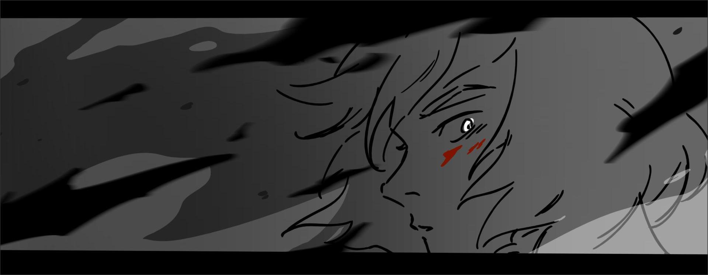
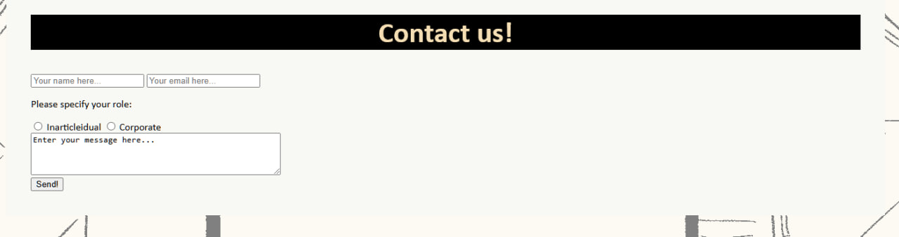

# 📜 Description

This webpage is an pitch bible for 'SkyBound', an original animated series idea, created as an online documentation of the visual and story development process, as well as a way to connect with others that are interested in the project. 

# 🔧 Project Setup

The webpage contains 4 sections:

- Home - contains description about the world setup, and a youtube video of the opening animatic
- Development Blog - contains more details on the worldbulilding, including sketches of environment and props designs
- FAQ - contains answers to the frequently asked questions regarding the project
- Contact - where the user can send messages to the people behind the project

**Language:** HTML, CSS, JavaScript

# ✨ Interactive Elements

- **Autoscroll navigation links**, which will enable the user to directly go to their desired content by clicking the link without having to scroll far down.
.png)

    > :warning: This feature is not yet implemented.
 

- **Change content language**, this page will support two languages: English and Indonesian -- which can be interchanged using this dropdown menu,
.png)

    > :warning: This feature is not yet implemented.

- **Send message**, which can be accessed on the bottom of the page -- where user can choose to write a message by typing in their name and email address, choosing their specific role, and write their message inside the text area, and click on the send button to submit.

    > :warning: This feature is not yet implemented.
